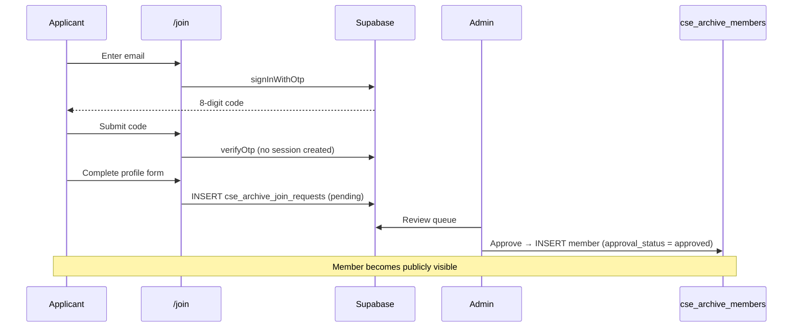

A searchable alumni directory and member portal for the Department of Computer
Science and Engineering, Dhaka University of Engineering and Technology (DUET),
Gazipur.

Visitors can browse and search the archive, sign in with a passwordless email
code, and update their own profile. New members apply through a verified Join
flow, and every application is reviewed by an administrator before it becomes
public.

---

## Table of contents

- [Features](#features)
- [Tech stack](#tech-stack)
- [Quick start](#quick-start)
- [Environment variables](#environment-variables)
- [Database setup](#database-setup)
- [Scripts](#scripts)
- [Project structure](#project-structure)
- [Architecture](#architecture)
  - [Dual UI: mobile vs desktop](#dual-ui-mobile-vs-desktop)
  - [Data layer](#data-layer)
  - [Join and approval workflow](#join-and-approval-workflow)
  - [Authentication](#authentication)
- [Deployment](#deployment)
- [Security notes](#security-notes)
- [Troubleshooting](#troubleshooting)

---

## Features

**Public**

- Searchable directory with live filtering by name, student ID, company,
  designation, and location
- Blood group filter, four sort orders, and grid/list density views
- Member profile sheet with contact actions and a downloadable ID card
  (rendered client-side with `html2canvas`)
- Passwordless sign-in via an 8-digit emailed code
- Self-service profile editing for signed-in members
- Join Archive application flow with email verification
- Light, dark, and system themes
- Dedicated mobile interface for phones

**Admin**

- Dashboard with archive and traffic overview
- Member CRUD, bulk import from Excel, and bulk update
- Join request queue with approve/reject and rejection reasons
- Administrator management and status toggling
- Analytics: page views, profile views, and per-query search analytics
- Site appearance settings
- Storage metrics and an audit log

---

## Tech stack

| Layer | Choice |
| --- | --- |
| Framework | React 19 + TypeScript |
| Build | Vite 6 |
| Routing | React Router 7 |
| Styling | Tailwind CSS 3.4 (dark mode via class strategy) |
| Icons | lucide-react |
| Database | Supabase (Postgres + Auth + RLS) |
| Photo storage | Cloudflare R2 (S3-compatible, presigned URLs) |
| Spreadsheets | SheetJS (`xlsx`) for bulk import |
| Card export | html2canvas |

---

## Quick start

**Requirements:** Node.js 20+ and npm.

```bash
git clone <repository-url>
cd alumni
npm install
cp .env.example .env    # then fill in your values
npm run dev
```

The dev server runs on [http://localhost:3000](http://localhost:3000) and binds
to all interfaces.

> Without Supabase credentials the app still runs. Auth falls back to a
> simulation mode where any 4-or-more digit code is accepted (`12345678` works),
> and member data is served from the bundled seed dataset.

---

## Environment variables

Copy `.env.example` to `.env` and fill in the values.

| Variable | Required | Purpose |
| --- | --- | --- |
| `VITE_SUPABASE_URL` | For real auth | Supabase project URL |
| `VITE_SUPABASE_ANON_KEY` | For real auth | Supabase anon/public key |
| `VITE_R2_ENDPOINT` | For photos | R2 endpoint, e.g. `https://<account>.r2.cloudflarestorage.com` |
| `VITE_R2_ACCESS_KEY_ID` | For photos | R2 access key ID |
| `VITE_R2_SECRET_ACCESS_KEY` | For photos | R2 secret access key |
| `VITE_R2_BUCKET_NAME` | For photos | R2 bucket name |

> **The `VITE_` prefix is required.** Vite only exposes prefixed variables to
> browser code. Defining an unprefixed `R2_SECRET_ACCESS_KEY` has no effect.
>
> These variables are embedded in the client bundle at build time. Treat the R2
> keys as public and scope them to a read-only bucket policy. Never place a
> service-role key or database URL in a `VITE_`-prefixed variable.

If R2 variables are absent the app degrades gracefully to generated SVG avatars
rather than erroring.

---

## Database setup

Run the migration once in the **Supabase SQL Editor** (Dashboard → SQL Editor →
New query). The repository has no migration runner, so the schema lives only in
the live database.

```bash
# open supabase/migrations/001_member_approval_status.sql and paste it into the editor
```

The migration is idempotent and safe to re-run. It:

1. Adds `approval_status` (`approved` / `pending` / `rejected`) to
   `cse_archive_members`, defaulting to `approved`
2. Backfills existing rows to `approved`, so the existing archive keeps working
   unchanged
3. Adds review columns: `reviewed_by`, `reviewed_at`, `rejection_reason`
4. Creates `cse_archive_join_requests` as the staging table for applications
5. Enables row level security with insert-from-anon and
   authenticated-read/update policies
6. Adds supporting indexes, including a partial unique index that prevents
   duplicate pending requests per email address

---

## Scripts

| Command | Description |
| --- | --- |
| `npm run dev` | Start the dev server |
| `npm run build` | Type-check then build for production |
| `npm run preview` | Serve the production build locally |
| `npm run lint` | Run ESLint |

---

## Project structure

```
src/
├── App.tsx                    Root router; picks mobile vs desktop UI
├── components/
│   ├── admin/                 Admin console (10 tabs)
│   ├── common/                Navbar, Footer, LoginModal, Pagination
│   ├── directory/             MemberCard, MemberModal, FilterBar
│   └── mobile/                Mobile shell, cards, and bottom sheets
├── context/                   AuthContext, ThemeContext
├── data/                      Seed datasets
├── hooks/
│   ├── useDeviceType.ts       Device detection and UI override
│   └── useMemberDirectory.ts  Shared search/filter/sort/pagination logic
├── lib/
│   ├── r2.ts                  Photo URLs, avatars, uploads
│   ├── seriesBatch.ts         Series/batch derivation from student IDs
│   ├── storage.ts             Data layer (localStorage + Supabase)
│   └── supabase.ts            Supabase client
├── pages/                     Desktop pages
│   └── mobile/                Mobile pages and shell
└── types/                     Shared TypeScript types

supabase/migrations/           SQL migrations (run manually)
```

---

## Architecture

### Dual UI: mobile vs desktop

`src/hooks/useDeviceType.ts` classifies the device and the app renders one of two
independent interfaces:

| Viewport | Interface |
| --- | --- |
| ≤ 767px | Mobile UI (`src/pages/mobile/MobileApp.tsx`) |
| 768–1023px (tablet) | Default UI |
| ≥ 1024px | Default UI |

The two interfaces share all data, auth, and business logic and differ only in
presentation. The mobile UI adds a fixed header, an independently scrolling
content region, a bottom tab bar, bottom sheets instead of modals, and infinite
scroll in place of pagination.

**The admin panel is excluded.** `/admin/*` always renders the desktop console,
even on a phone.

Two useful details:

- `m-*` CSS classes in `src/index.css` are scoped to `<html class="mobile-ui">`
  and use `dvh` plus `env(safe-area-inset-*)` for notch and home-indicator
  clearance
- Set `localStorage['cse_archive_ui_mode']` to `mobile`, `desktop`, or `auto` to
  override detection. The **UI** button in the bottom-right corner (desktop
  only) sets it, which makes previewing either interface on any screen easy

### Data layer

`src/lib/storage.ts` is localStorage-first with Supabase as the backing store:

1. Reads return instantly from the localStorage cache
2. A background Supabase fetch refreshes the cache
3. Writes update localStorage immediately, then sync to Supabase

This keeps the interface responsive on slow connections while still persisting
remotely.

Only these tables are synced to Supabase:

| Table | Purpose |
| --- | --- |
| `cse_archive_members` | Member records, including approval state |
| `cse_archive_join_requests` | Staging table for Join applications |

Site settings, admin users, and audit logs are currently localStorage-only.

**Visibility rule.** Public pages read `getPublicMembers()`, which returns
approved records only. Admin pages read `getMembers()`, which returns everything.
Any new public surface must use the former.

### Join and approval workflow



Key properties:

- Email ownership is proven before any data can be submitted
- The applicant is **not** signed in by the verification step; no member record
  exists yet
- A partial unique index blocks duplicate pending requests for one email
- Rejections store a reason that the applicant can read and act on
- Every transition writes an audit log entry

### Authentication

Passwordless, via Supabase Auth. `sendOtp` requires an existing member or admin
record; the Join flow uses separate `sendJoinOtp` / `verifyJoinOtp` helpers that
do not, since applicants are by definition new. `verifyJoinOtp` deliberately
avoids creating a session.

Sessions are cached in `localStorage['cse_archive_auth_email']` and restored on
load.

---

## Deployment

The app deploys to Vercel with no additional configuration. `vercel.json` already
contains the SPA rewrite so client-side routes resolve correctly on refresh.

1. Push the repository and import it into Vercel
2. Vercel detects Vite automatically
3. Add the environment variables listed above under **Project → Settings →
   Environment Variables**
4. Deploy

After deploying, run the SQL migration and set the same variables in any other
environment you use.

---

## Security notes

**Rotate any credential that was ever committed.** If R2 keys, a database URL, or
an admin password appeared in git history, treat them as public. Remove them from
the code, rotate them at the provider, and purge them from history if needed.

Recommendations for this project:

- Scope R2 keys to read-only. Presigned URLs are generated in the browser, so the
  secret is unavoidably present client-side
- Move approval decisions behind a Supabase Edge Function if you need tamper-proof
  enforcement; today an authenticated user with the anon key could call the
  update policy directly
- Replace the hard-coded super-admin email check in `AuthContext` and `storage.ts`
  with a database-driven role lookup
- Serve the site over HTTPS

---

## Troubleshooting

**All photos show placeholder avatars**
The `VITE_R2_*` variables are missing or misspelled. Vite ignores variables
without the `VITE_` prefix. Verify with `grep VITE_R2 .env`.

**Sign-in codes are rejected**
Real delivery requires SMTP to be configured on the Supabase project. Without it,
`signInWithOtp` fails. Leave the Supabase variables unset to use simulation mode.

**Members appear locally but not for other visitors**
Approval state and admin actions are stored per-browser for some tables. Run the
SQL migration so `approval_status` exists in Postgres.

**The mobile UI shows on desktop, or vice versa**
Clear `localStorage['cse_archive_ui_mode']`, or use the **UI** button in the
bottom-right corner.

**Changes to default site copy do not appear**
Site settings persist in localStorage. `migrateSettingsCopy()` in `storage.ts`
rewrites only values matching a previously shipped default, so custom wording set
through the admin panel is preserved. Add the old wording to
`SETTINGS_COPY_MIGRATIONS` when changing defaults.

**Build fails on a fresh clone with a missing-module error**
Check for stale git index entries:

```bash
for f in $(git ls-files); do [ -f "$f" ] || echo "MISSING: $f"; done
```