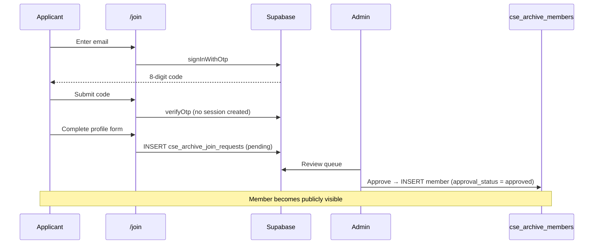

A searchable alumni directory and member portal for the Department of Computer
Science and Engineering, Dhaka University of Engineering and Technology (DUET),
Gazipur.

Visitors can browse and search the archive, sign in with a passwordless email
code, and update their own profile. New members apply through a verified Join
flow, and every application is reviewed by an administrator before it becomes
public.

---

## Table of contents

- [Features](#features)
- [Tech stack](#tech-stack)
- [Quick start](#quick-start)
- [Environment variables](#environment-variables)
- [Database setup](#database-setup)
- [Serverless functions](#serverless-functions)
- [Scripts](#scripts)
- [Project structure](#project-structure)
- [Architecture](#architecture)
  - [Dual UI: mobile vs desktop](#dual-ui-mobile-vs-desktop)
  - [Data layer](#data-layer)
  - [Join and approval workflow](#join-and-approval-workflow)
  - [Authentication](#authentication)
- [Deployment](#deployment)
- [Security notes](#security-notes)
- [Troubleshooting](#troubleshooting)

---

## Features

**Public**

- Searchable directory with live filtering by name, student ID, company,
  designation, and location
- Blood group filter, four sort orders, and grid/list density views
- Member profile sheet with contact actions and a downloadable ID card
  (rendered client-side with `html2canvas`)
- Passwordless sign-in via an 8-digit emailed code
- Self-service profile editing for signed-in members
- Join Archive application flow with email verification
- Light, dark, and system themes
- Dedicated mobile interface for phones

**Admin**

- Dashboard with archive and traffic overview
- Member CRUD, bulk import from Excel, and bulk update
- Join request queue with approve/reject and rejection reasons
- Administrator management and status toggling
- Analytics: page views, profile views, and per-query search analytics
- Site appearance settings
- Storage metrics and an audit log

---

## Tech stack

| Layer | Choice |
| --- | --- |
| Framework | React 19 + TypeScript |
| Build | Vite 6 |
| Routing | React Router 7 |
| Styling | Tailwind CSS 3.4 (dark mode via class strategy) |
| Icons | lucide-react |
| Database | Supabase (Postgres + Auth + RLS) |
| Photo storage | Cloudflare R2 (S3-compatible, presigned URLs signed server-side) |
| Spreadsheets | SheetJS (`xlsx`) for bulk import |
| Card export | html2canvas |

---

## Quick start

**Requirements:** Node.js 20+ and npm.

```bash
git clone <repository-url>
cd alumni
npm install
cp .env.example .env    # then fill in your values
npm run dev
```

The dev server runs on [http://localhost:3000](http://localhost:3000) and binds
to all interfaces.

> Without Supabase credentials the app still runs. Auth falls back to a
> simulation mode where any 4-or-more digit code is accepted (`12345678` works),
> and member data is served from the bundled seed dataset.

---

## Environment variables

Copy `.env.example` to `.env` and fill in the values.

### Browser-exposed

| Variable | Required | Purpose |
| --- | --- | --- |
| `VITE_SUPABASE_URL` | Yes | Supabase project URL |
| `VITE_SUPABASE_ANON_KEY` | Yes | Supabase anon/public key |

These two are safe to expose — the anon key is public by design and access is
governed by Row Level Security.

### Server-only (never prefix with `VITE_`)

| Variable | Required | Purpose |
| --- | --- | --- |
| `R2_ENDPOINT` | For photos | R2 endpoint, e.g. `https://<account>.r2.cloudflarestorage.com` |
| `R2_ACCESS_KEY_ID` | For photos | R2 access key ID |
| `R2_SECRET_ACCESS_KEY` | For photos | R2 secret access key |
| `R2_BUCKET_NAME` | For photos | R2 bucket name |

> **Do not add a `VITE_` prefix to any of these.** Vite inlines every
> `VITE_`-prefixed variable into the public JavaScript, so a prefixed R2 secret
> would be readable by anyone who loads the site. These are read only by the
> serverless functions in `api/`, which run on Vercel.

In Vercel, add the server-only four under **Settings → Environment Variables**.
Scope the R2 key to read/write on that one bucket — no other bucket needs it.

If the R2 variables are absent the app degrades gracefully to generated SVG
avatars rather than erroring.

---

## Database setup

Run the migrations once in the **Supabase SQL Editor** (Dashboard → SQL Editor →
New query), in order. The repository has no migration runner, so the schema
lives only in the live database. All of them are idempotent and safe to re-run.

| Order | File | Purpose |
| --- | --- | --- |
| 1 | `001_member_approval_status.sql` | Approval workflow and the join-request staging table |
| 2 | `002_join_requests_missing_columns.sql` | Adds columns the staging table is missing |
| 3 | `003_members_missing_columns.sql` | Adds the approval columns to the members table |
| 4 | `004_admin_users_table.sql` | Administrator roster in Postgres |
| 5 | `005_tighten_rls_admin_checks.sql` | Makes RLS actually enforce admin-only writes |
| 6 | `006_close_admin_roster_hole.sql` | **Urgent.** Removes the live write policies on the roster |

> **Run all six.** `001` used `create table if not exists`, so on a database
> where the tables already existed its later columns were silently skipped —
> which is why `002` and `003` exist. If you only run `001`, every write fails
> with `PGRST204`.

> **`006` is urgent and independent.** It closes a hole that is live on the
> current database *right now*: the anon key — the one in the public bundle —
> can INSERT, UPDATE and DELETE rows in `cse_archive_admin_users`. Verified
> against production: `INSERT` → 201, escalate any account to `super_admin` →
> 204, `DELETE` → 204. That is full takeover of the admin console by an
> anonymous visitor. Run `006` before anything else.

> **`005` is the security-critical one for the other tables.** `002` and `003`
> left write policies open to *any* signed-in user (`using (true)`). Because the
> Supabase anon key ships in the public bundle, anyone could call the REST API
> directly and approve their own application, delete members, or read the whole
> join-request queue. `005` replaces those with a `public.is_active_admin()`
> check. Until you run it, those tables are still open to any account that signs
> up.

`001` adds the approval workflow: an `approval_status` column
(`approved` / `pending` / `rejected`) defaulting to `approved`, review columns
(`reviewed_by`, `reviewed_at`, `rejection_reason`), the
`cse_archive_join_requests` staging table, RLS policies, and supporting
indexes.

`004` creates `cse_archive_admin_users` and seeds the existing super
administrator. This is what makes admin status server-controlled rather than a
localStorage array anyone can edit, and it is the roster `/api/photo-upload`
checks before accepting an upload.

---

## Serverless functions

Vercel deploys everything in `api/` automatically — no configuration needed.
They read the server-only environment variables described above.

| Endpoint | Method | Auth | Purpose |
| --- | --- | --- | --- |
| `/api/photo-url` | `GET`, `POST` | None (the bucket stays private) | Signs a `photos/…` key into a 24 h URL |
| `/api/photo-upload` | `POST` | Active administrator | Stores an uploaded photo and returns its key |
| `/api/admin-roster` | `POST` | Active administrator | Adds an admin or changes an account's status |

`/api/photo-url` rejects anything outside the `photos/` prefix and any path
containing `..`, so it cannot be used to sign arbitrary objects.

`/api/photo-upload` and `/api/admin-roster` resolve the caller's Supabase
session to an email and check that email against `cse_archive_admin_users`. If
the database is unreachable they **fail closed** and reject the request.

`/api/admin-roster` exists because the roster table deliberately grants the
browser no write policy. It also enforces two rules the browser cannot: only a
super administrator may create or change another super administrator, and the
last active super administrator cannot be disabled (which would lock the site
out of its own admin console).

### Local development

`vite preview` and `vite dev` serve only the static bundle, so `/api/*` will 404
and photos fall back to generated SVG avatars. To exercise the real endpoints:

```bash
npx vercel dev
```

---

## Scripts

| Command | Description |
| --- | --- |
| `npm run dev` | Start the dev server |
| `npm run build` | Type-check then build for production |
| `npm run preview` | Serve the production build locally |
| `npm run lint` | Run ESLint |

---

## Project structure

```
api/                           Serverless functions (Vercel, auto-detected)
├── photo-url.js               Signs a photos/ key into a temporary URL
└── photo-upload.js            Stores an uploaded photo (admin only)

src/
├── App.tsx                    Root router; picks mobile vs desktop UI
├── components/
│   ├── admin/                 Admin console (10 tabs)
│   ├── common/                Navbar, Footer, LoginModal, ErrorBoundary
│   ├── directory/             MemberCard, MemberModal, FilterBar
│   └── mobile/                Mobile shell, cards, and bottom sheets
├── context/                   AuthContext, ThemeContext
├── data/                      Seed datasets
├── hooks/
│   ├── useDeviceType.ts       Device detection and UI override
│   ├── useMemberDirectory.ts  Shared search/filter/sort/pagination logic
│   └── usePersistentState.ts  UI state (tabs, layout) remembered across reloads
├── lib/
│   ├── r2.ts                  Photo URLs, avatars, uploads
│   ├── canvasImage.ts         CORS-safe image probe for card export
│   ├── seriesBatch.ts         Series/batch derivation from student IDs
│   ├── storage.ts             Data layer (localStorage + Supabase)
│   └── supabase.ts            Supabase client
├── pages/                     Desktop pages
│   └── mobile/                Mobile pages and shell
└── types/                     Shared TypeScript types

supabase/migrations/           SQL migrations (run manually)
```

---

## Architecture

### Dual UI: mobile vs desktop

`src/hooks/useDeviceType.ts` classifies the device and the app renders one of two
independent interfaces:

| Viewport | Interface |
| --- | --- |
| ≤ 767px | Mobile UI (`src/pages/mobile/MobileApp.tsx`) |
| 768–1023px (tablet) | Default UI |
| ≥ 1024px | Default UI |

The two interfaces share all data, auth, and business logic and differ only in
presentation. The mobile UI adds a fixed header, an independently scrolling
content region, a bottom tab bar, bottom sheets instead of modals, and infinite
scroll in place of pagination.

**The admin panel is excluded.** `/admin/*` always renders the desktop console,
even on a phone.

Two useful details:

- `m-*` CSS classes in `src/index.css` are scoped to `<html class="mobile-ui">`
  and use `dvh` plus `env(safe-area-inset-*)` for notch and home-indicator
  clearance
- Set `localStorage['cse_archive_ui_mode']` to `mobile`, `desktop`, or `auto` to
  override detection. The **UI** button in the bottom-right corner (desktop
  only) sets it, which makes previewing either interface on any screen easy

### Data layer

`src/lib/storage.ts` is localStorage-first with Supabase as the backing store:

1. Reads return instantly from the localStorage cache
2. A background Supabase fetch refreshes the cache
3. Writes update localStorage immediately, then sync to Supabase

This keeps the interface responsive on slow connections while still persisting
remotely.

Only these tables are synced to Supabase:

| Table | Purpose |
| --- | --- |
| `cse_archive_members` | Member records, including approval state |
| `cse_archive_join_requests` | Staging table for Join applications |

Site settings, admin users, and audit logs are currently localStorage-only.

**Visibility rule.** Public pages read `getPublicMembers()`, which returns
approved records only. Admin pages read `getMembers()`, which returns everything.
Any new public surface must use the former.

### Join and approval workflow



Key properties:

- Email ownership is proven before any data can be submitted
- The applicant is **not** signed in by the verification step; no member record
  exists yet
- A partial unique index blocks duplicate pending requests for one email
- Rejections store a reason that the applicant can read and act on
- Every transition writes an audit log entry

### Authentication

Passwordless, via Supabase Auth. `sendOtp` requires an existing member or admin
record; the Join flow uses separate `sendJoinOtp` / `verifyJoinOtp` helpers that
do not, since applicants are by definition new. `verifyJoinOtp` deliberately
avoids creating a session.

Sessions are cached in `localStorage['cse_archive_auth_email']` and restored on
load.

---

## Deployment

The app deploys to Vercel with no additional configuration. `vercel.json` already
contains the SPA rewrite so client-side routes resolve correctly on refresh.

1. Push the repository and import it into Vercel
2. Vercel detects Vite automatically
3. Add the environment variables listed above under **Project → Settings →
   Environment Variables**
4. Deploy

After deploying, run the SQL migration and set the same variables in any other
environment you use.

---

## Security notes

**Rotate any credential that was ever committed.** If R2 keys, a database URL, or
an admin password appeared in git history, treat them as public. Remove them from
the code, rotate them at the provider, and purge them from history if needed.

### Already addressed

- **The R2 secret is no longer in the browser bundle.** It used to be read from
  `VITE_R2_SECRET_ACCESS_KEY`, which Vite inlines into the public JavaScript —
  handing anyone who loaded the site a full bucket credential. Signing now
  happens in `/api/photo-url` using server-only variables. Never re-add a
  `VITE_` prefix to a credential.
- **Admin status is server-controlled.** The roster moved from a localStorage
  array (editable in DevTools) to `cse_archive_admin_users`. The hardcoded
  super-admin email check has been removed from both the bundle and the sign-in
  path, and a stale cached grant is re-verified against the roster on load.
- **Database writes now require a real administrator** (migration `005`).
  Previously the RLS write policies were `using (true)` for every signed-in
  user, and since the anon key is public that meant anyone could approve their
  own application or delete members. Writes are gated on
  `public.is_active_admin()`, which reads the JWT email — never a client-supplied
  column.
- **Join-request contents are no longer readable by any signed-in user.** The
  old policy used `auth.uid() is not null`, so any applicant who signed up could
  read every pending application, including other people's email and phone
  numbers. Reads are now admin-only.
- **The roster `id` column is a `uuid`, not text.** This is worth knowing before
  you edit the migrations: seeding it with a readable value like
  `admin-super-mohatamim` fails with
  `22P02 invalid input syntax for type uuid`. Let the column default generate
  the uuid instead. The server code sends `id` only when updating an existing
  row.

### Still worth doing

- **Rotate the R2 keys and the admin password.** Both were committed before the
  cleanup above, so they remain in git history even though neither is in the
  current bundle.
- **Approval decisions are still client-driven.** An admin's *decision* is
  recorded from the browser, so the audit trail depends on the client telling
  the truth about what was approved. The database now guarantees only *who* may
  write, not what they wrote.
- **Photo keys are public.** Anyone can request a signed URL for any
  `photos/…` key. That is fine here because member records are already public,
  but it means the bucket is not a place for private images.
- Serve the site over HTTPS.

### Required once: R2 bucket CORS

**"Save Card" downloads the card without the member photo** until this is set.
html2canvas draws the card onto a `<canvas>`, and the browser refuses to export
a canvas that was tainted by a cross-origin image with no CORS headers. The R2
bucket sends none by default, so `toDataURL()` throws a SecurityError.

Set it in the Cloudflare dashboard (**R2 → `cse-alumni` → Settings → CORS
Policy**), because the R2 API keys are scoped and cannot write bucket
configuration:

| Setting | Value |
| --- | --- |
| AllowedOrigins | `*` |
| AllowedMethods | `GET`, `HEAD` |
| AllowedHeaders | `*` |
| ExposeHeaders | `ETag` |
| MaxAgeSeconds | `86400` |

This does **not** make the photos public. Every object still requires a valid
presigned URL; CORS only decides whether a browser page that already holds such
a URL may read the response.

Until then the app degrades gracefully: it detects the tainted canvas and
exports the card without the photo rather than failing outright.

---

## Troubleshooting

**All photos show placeholder avatars**
The `VITE_R2_*` variables are missing or misspelled. Vite ignores variables
without the `VITE_` prefix. Verify with `grep VITE_R2 .env`.

**"Save Card" produces a card with no photo**
The bucket has no CORS policy, so the canvas is tainted and the export is
blocked. See [R2 bucket CORS](#required-once-r2-bucket-cors) above.

**"Save Card" fails outright**
Open the browser console. A `SecurityError` on `toDataURL()` means the CORS
policy is missing. A blank download usually means `html2canvas` hit a layout it
cannot parse; re-run after the modal has fully animated in.

**"Request saved, but the server could not be reached"**
PostgREST rejected the write with `PGRST204`, meaning the table is missing a
column the app sends. Run migrations `002` and `003` in the Supabase SQL editor.

**Sign-in codes are rejected**
Real delivery requires SMTP to be configured on the Supabase project. Without it,
`signInWithOtp` fails. Leave the Supabase variables unset to use simulation mode.

**Members appear locally but not for other visitors**
Approval state and admin actions are stored per-browser for some tables. Run the
SQL migration so `approval_status` exists in Postgres.

**The mobile UI shows on desktop, or vice versa**
Clear `localStorage['cse_archive_ui_mode']`, or use the **UI** button in the
bottom-right corner.

**Changes to default site copy do not appear**
Site settings persist in localStorage. `migrateSettingsCopy()` in `storage.ts`
rewrites only values matching a previously shipped default, so custom wording set
through the admin panel is preserved. Add the old wording to
`SETTINGS_COPY_MIGRATIONS` when changing defaults.

**Build fails on a fresh clone with a missing-module error**
Check for stale git index entries:

```bash
for f in $(git ls-files); do [ -f "$f" ] || echo "MISSING: $f"; done
```